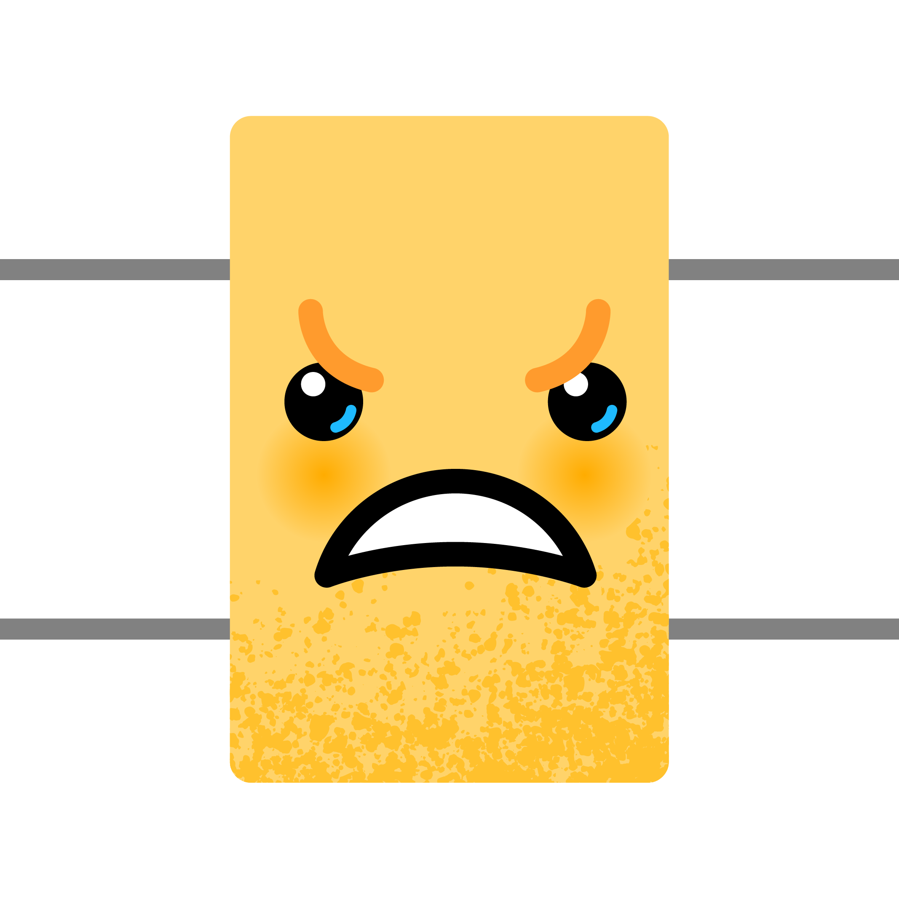

# gatemojis

Quantum algorithm design is hard. Express your feelings through quantum circuits with Gatemojis™. Download and use Gatemojis across Slack, Discord, and anywhere else that supports custom emojis!

## Available gatemojis

### Circuit elements

Gatemoji | Alias
-------- | -----
 | `:gate-prep:`
 | `:gate-cnot:`
 | `:gate-cnot2:`
 | `:gate-double:`
 | `:gate-multi:`
 | `:gate-bottom:`
 | `:gate-top:`
 | `:gate-wires:`
 | `:gate-swap:`
 | `:gate-ctrl:`
 | `:gate-ctrl2:`
 | `:gate-measure:`
 | `:gate-measure2:`

### Faces

Gatemoji | Alias
-------- | -----
 | `:gate-smile:`
 | `:gate-laugh:`
 | `:gate-frown:`
 | `:gate-angry:`
 | `:gate-wink:`
 | `:gate-sweat:`
 | `:gate-tear:`
 | `:gate-evil:`
 | `:gate-facepalm:`
 | `:gate-love:`
 | `:gate-shock:`
 | `:gate-thinking:`

### Symbols

Gatemoji | Alias
-------- | -----
 | `:gate-pl:`
 | `:gate-lightning:`
 | `:gate-cactus:`
 | `:gate-heart:`
 | `:gate-question:`
 | `:gate-exclaim:`
 | `:gate-100:`
 | `:gate-bread:`
 | `:gate-toast:`
 | `:gate-vegemite:`

## Image guidelines.

Gatemojis are designed to be legible on both light or dark backgrounds, and at a small size. Use the guideline below to make sure your gatemoji always look their best 💄

