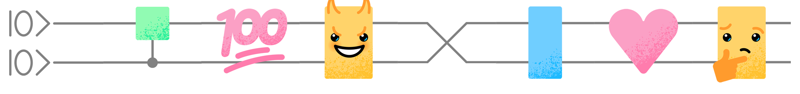

# PennyLane Gatemojis

Quantum algorithm design is hard, so express your feelings through quantum circuits with Gatemojis. Gatemojis are designed to be used by themselves or together — put them side-by-side for their wires to automatically connect.

Gatemojis have been specially created to be legible on both light or dark backgrounds, and at a small size to always look their best 💄

Save the Gatemoji images and use Gatemojis across [Slack](https://slack.com/help/articles/206870177-Add-custom-emoji-and-aliases-to-your-workspace), [Discord](https://support.discord.com/hc/en-us/articles/360036479811-Custom-Emojis), and anywhere else that supports custom emojis.

## Available gatemojis

Gatemoji | Alias | Gatemoji | Alias | Gatemoji | Alias
-------- | ----- | -------- | ----- | -------- | -----
 | `:gate-prep:` |  | `:gate-pl:` |  | `:gate-vegemite:`
 | `:gate-cnot:` |  | `:gate-smile:` |  | `:gate-lightning:`
 | `:gate-cnot2:` |  | `:gate-laugh:` |  | `:gate-cactus:`
 | `:gate-double:` |  | `:gate-frown:` |  | `:gate-heart:`
 | `:gate-multi:` |  | `:gate-angry:` |  | `:gate-question:`
 | `:gate-bottom:` |  | `:gate-wink:` |  | `:gate-exclaim:`
 | `:gate-top:` |  | `:gate-sweat:` |  | `:gate-100:`
 | `:gate-wires:` |  | `:gate-tear:` |  | `:gate-bread:`
 | `:gate-swap:` |  | `:gate-evil:` |  | `:gate-toast:`
 | `:gate-ctrl:` |  | `:gate-facepalm:` |  | `:gate-thinking:`
 | `:gate-ctrl2:` |  | `:gate-love:` |  | `:gate-measure2:` 
 | `:gate-measure:` |  | `:gate-shock:` |  | `:gate-cyclops:`
 | `:gate-dnot:` |  | `:gate-wave:` |  | `:gate-rocket:` 
 | `:gate-donut:` |  | `:gate-xanadu:` |  | `:gate-grimace:`

## License

 
<a property="dct:title"
 rel="cc:attributionURL"
 href="https://github.com/PennyLaneAI/gatemojis">Gatemojis</a> by <a
 rel="cc:attributionURL dct:creator" property="cc:attributionName"
 href="https://pennylane.ai">PennyLaneAI</a> is licensed under <a
 href="http://creativecommons.org/licenses/by-sa/4.0/?ref=chooser-v1"
 target="_blank" rel="license noopener noreferrer"
 style="display:inline-block;">CC BY-SA 4.0</a>

 Feel free to download them, remix them, and use them!

